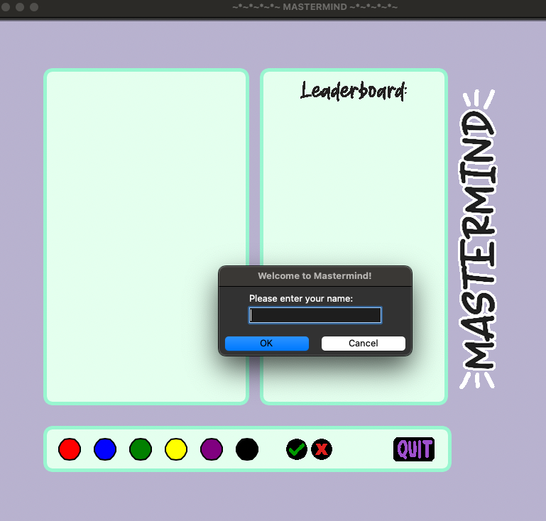
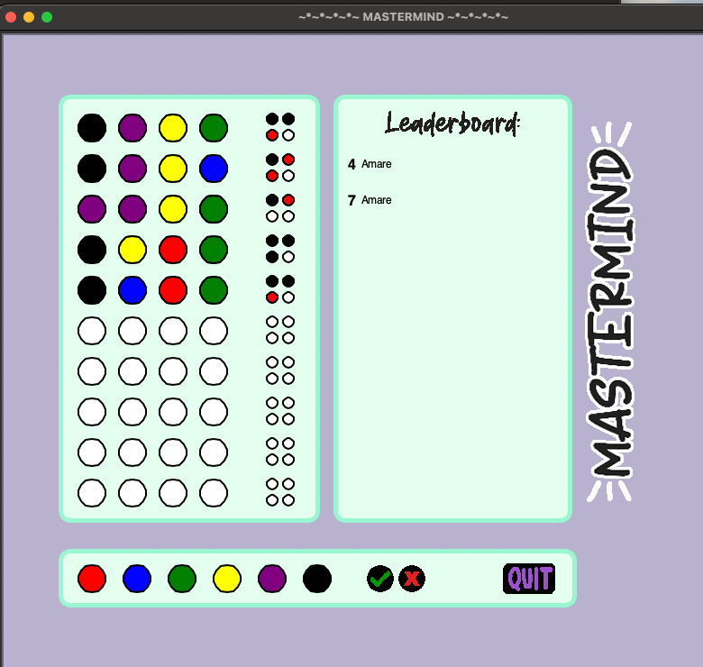

# Mastermind Game (Python)
Welcome to my version of the classic Mastermind game, pitting you against a computer opponent. 

Getting Started:

### Enter your name in the welcome popup to kick things off.



### Gameplay:

<ol>
    <li>You've got 10 rounds to crack the four-color code.</li>
    <li>Your guesses are laid out in 10 rows of 4 large circles on the screen.</li>
    <li>Use the six colored circles at the bottom to pick the four colors for your code.</li>
        <ul>
            <li>Order matters and colors can repeat!</li>
            <li>Made a mistake? The red "x" lets you backtrack</li>
            <li>Quit anytime without saving your name or score.
        </ul>
    <li>Click the green checkmark to submit your guess and get feedback from the CPU</li>
        <li>Each guess row has four smaller circles to the right, indicating feedback for that row:</li>
        <ul>
            <li>Black circles mean you've got a correct color in the correct spot (bulls).</li>
            <li>Red circles mean you've got a correct color but in the wrong spot (cows).</li>
        </ul>
    <li>Crack the code in 10 rounds, and your name goes on the Leaderboard.</li>
    <li>The Leaderboard on the right keeps track of past players and their scores.</li>
    <br>
    


    
     

</ol>


# Compilation Notes
On command line use:
```
python3 mastermind_game.py
```
# Packages Needed:
This graphics in this game were created using <a href="https://docs.python.org/3/library/turtle.html"> Turtle graphics</a> library while <a href="https://docs.python.org/3/library/tkinter.html">Tk interface</a> is used for the GUI.

## Creator's Notes
<i>The Mastermind Game project is a Python-based application I created during the early stages of <a href="https://www.khoury.northeastern.edu/programs/align-masters-of-science-in-computer-science">the Align Program at Northeastern University</a>.  While a relatively simple game, Mastermind holds significance as a starting point in my study of computer science. It captures my early days of dipping into programming - learning the fundamentals of object-oriented Programming and figuring out how to blend design elements into a real-world application. During this time, I started learning the fundamentals of object-oriented programming, a methodology I've adhered to ever since. What makes it even more special is that it was the first time I enjoyed full creative autonomy over a project of my own, venturing into the world of GUI and applying my design skills in a new field.</i>

I worked independently on this project, acting as the sole contributor.
<p>
<b>Learning Objectives:</b> The project aimed to solidify my understanding of fundamental programming concepts, including global vs local scope, classes, and the basics of object-oriented programming.
<br>
<b>Integration of Design:</b> Leveraging my graphic design skills, I crafted all the visual elements of the game, including images and the graphical user interface (GUI).

## Technologies Used:
<p><b>Language:</b> Python
<p><b>GUI:</b> Tk Interface
<p><b>Graphics:</b> Turtle Graphics

## Original Read Me (4/2021):
<i>I favored using classes for most Turtle parts of my program as I was having
 difficulty getting the Turtle and non-Turtle parts to talk to each other
 without using global variables. Each item that the user needs to click I
 initialized with it's own variable name so it would be easy to keep track
 of where it was and if it was being clicked. For the part of the game board
 that displays the guesses and bulls/cows, I set up for loops to iterate thru
 the # of columns and rows needed. I made fuctions where you can easily adjust
 the size of the marbles, distance between them, and even how many you want
 in a row and column. The boolean value in the parameters indicates whether
 you're drawing the "column" marbles in one line for the user guesses or
 you're drawing the bull+cows - where the number of columns is halved and
 two marbles print in each column. As the game board is set up, each new
 Marble object is saved to a list - 1 for the guess marbles and 1 for the
 bull and cow marbles. Each is a list of lists. Each inner list represents
 a round of the game, each marble within that list represents one guess or
 one bull/cow result. I created another Class of object Round to keep track
 of what round and guess the player is currently on. At any time the program
 is able to access those numbers so it know which marble to update the player
 interacts with the board. the turtle parts of my program are in the file
 game_board.py.

 Class BackgroundShapes are for objects in the turtle screen that are not
 interacted with. I used it for any of the pop ups that are triggered by
 events and the rounded rectangles in the background of my gameboard. Given
 more time, I'd ideally separate these into two different classes or make
 one a subclass of the other, but I didn't have enought time to really
 figure out how to do subclasses before deadline :(.

 Class Buttons are for any objects in the turtle screen that will be interacted
 with. This includes the 6 colored marble buttons and the gif images that are
 used as the quit/check/x button. Again, in a future interation, I'll probably
 separate the marble objects and the raster images buttons into different
 subclasses as their methods are a bit different.

 Extra credit - I allowed for duplicate colors in my count_bulls_and_cows.
 I created a copy of both the guess and secret code lists so I could
 delete each marble as I scored it, without messing up the index I was
 iterating over.
 </i>
 
                                                    
